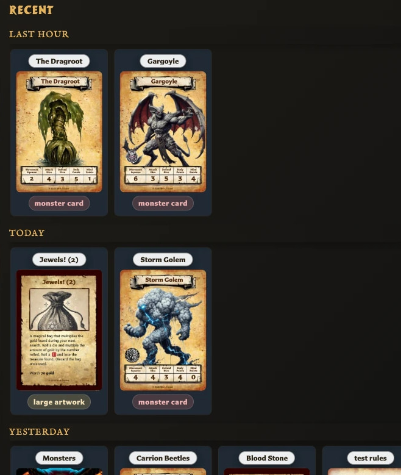

# View Your Recent Cards

Use **Recent** when you want to quickly return to a saved card that you opened before.

## Open a recent card

<!-- help-visual:p045:start -->
<figure class="hqcc-help-figure hqcc-help-figure--portrait" markdown="span">
  
  <figcaption>Recent groups changed cards by time so the latest work is easy to reopen.</figcaption>
</figure>
<!-- help-visual:p045:end -->

1. Choose **Recent** in the left navigation. It uses a clock icon.
2. Find the card in the list.
3. Choose the card to open it in the editor.

The Recent window closes after the card opens. Choose **Close** if you want to leave the window without opening another card.

## What counts as recent?

Recent is based on when a saved card was last **viewed or opened**. It is not a history of cards changed within each period.

Cards are shown with their name, thumbnail, and card type. The most recently viewed cards appear first and are divided into these time groups:

- **Last hour**
- **Today**
- **Yesterday**
- **This week**
- **This month**
- **Older**

Only groups containing cards are displayed.

## Recent window versus Recent in Cards

The **Recent** button in the left navigation opens the quick picker described above. The Cards workspace also contains a **Recent** option in its Collections panel; that option keeps you in the full Cards workspace and filters the library to recently viewed cards.

## Related help

- [Keyboard Shortcuts](../reference/keyboard-shortcuts.md)
- [Organize and Recover Cards](./organize-and-recover-cards.md)
- [Collections FAQ and Guides](./collections/index.md)
