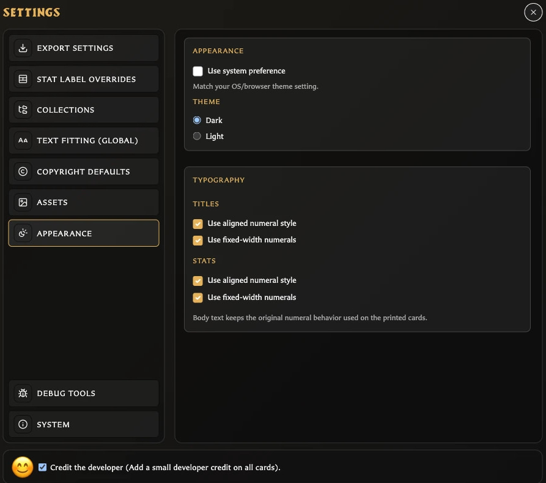

# Change Language and Appearance

Language changes the wording used by the app. Theme changes the app interface between Light, Dark, or the system preference. Neither action changes your saved cards, collections, decks, or assets.

## Change the app language

<!-- help-visual:p095:start -->
<figure class="hqcc-help-figure hqcc-help-figure--wide" markdown="span">
  
  <figcaption>Appearance controls change the app theme and numeral style without changing saved card content.</figcaption>
</figure>
<!-- help-visual:p095:end -->

1. Choose **Language** in the left navigation. The current choice is represented by its flag.
2. Choose the language you want.
3. The app updates its visible interface immediately.

The current language is omitted from the menu. This leaves the other choices available and uses the button flag to show the active choice.

The available languages in v0.8.0 are:

- English
- Czech
- Danish
- German
- Spanish
- French
- Italian
- Hungarian
- Dutch
- Norwegian Bokmal
- Polish
- Portuguese
- Brazilian Portuguese
- Finnish
- Swedish
- Greek
- Russian

## Switch back to English

If the app is currently in another language:

1. Find the flag button in the same left-navigation position.
2. Open it.
3. Choose **English** beside the UK flag.

The language names remain written in their own languages, which helps you recognize English even when the surrounding interface has changed.

## Change theme quickly

1. Choose **Theme** in the left navigation.
2. Choose **Light**, **Dark**, or **Use system preference**.

The choice applies immediately. **Use system preference** follows the operating-system or browser setting.

## Use the full Appearance settings

Open **Settings > Appearance** when you also want to configure numeral styling. In addition to the same theme choices, Titles and Stats each offer aligned and fixed-width numeral styles.

These options change how numbers are drawn in those card areas. Body text keeps its existing printed-card numeral behavior.

## Related help

- [Understand the Settings Window](./understand-the-settings-window.md)
- [Settings Reference](./settings-reference.md)
- [Keyboard Shortcuts](../reference/keyboard-shortcuts.md)
- [Fix Settings Problems](../troubleshooting/fix-settings-problems.md)
