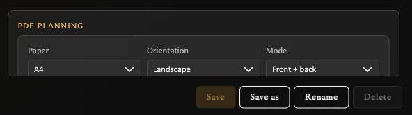

# Configure Export Defaults and Profiles

An export profile is a reusable group of image and PDF export settings. Use profiles when you regularly produce files for different printers, paper sizes, bleed requirements, or image treatments.

A profile has two related jobs:

- **Image export settings** control how each card face is prepared, including bleed, rounded corners, and trimming marks.
- **PDF settings** control how prepared card faces are placed on physical pages and how reverse sheets are arranged.

Profiles store starting values. Choosing a profile does not export anything by itself, and changing options for one PDF run does not rewrite the saved profile.

## When to use separate profiles

Create a profile when you repeatedly need the same combination of settings. Useful examples include:

<!-- help-visual:p092:start -->
<figure class="hqcc-help-figure hqcc-help-figure--portrait" markdown="span">
  
  <figcaption>Export profiles keep named combinations of image, mark, and PDF defaults ready for different jobs.</figcaption>
</figure>
<!-- help-visual:p092:end -->

- A clean digital-image profile with no bleed or marks for sharing card pictures.
- A home-print profile using your paper size, orientation, and tested duplex arrangement.
- A professional-print profile matching a print service's requested bleed and marks.
- A fronts-only proofing profile for checking card text and artwork without printing backs.

Do not assume one print profile will work with every printer. Paper handling and duplex flipping vary, and print services can request different bleed measurements or file preparation.

## Image export settings

These settings affect individual PNG card faces and can also affect the card images prepared for PDF export.

### Export with bleed

Bleed extends the card artwork beyond its final cut edge. It gives you a small safety area so slight cutting or printer-alignment differences are less likely to leave an unwanted white strip around the card.

**Bleed (px)** controls the amount added to every side of an exported card image. The **Final size** readout shows the resulting card dimensions before trimming marks add any additional surrounding space.

Use the measurement requested by your print service or established by your own test prints. More bleed is not automatically better: it increases the exported image and requires more room when cards are arranged on a page.

### Ask before export

Enable **Ask before export** when you want to review image options each time rather than always using the profile unchanged. Choices made in the export prompt apply to that export run; they do not replace the saved profile.

This is useful for a general-purpose profile. Leave it off when a named profile already represents a repeatable setup that should normally run without another question.

### Export rounded corners

Rounded corners make the exported image follow the visible rounded shape of the card. This is useful for clean digital images or workflows that expect the finished card silhouette.

Turn rounded corners off when a printer or cutting workflow expects a full rectangular image. Rounded corners are unavailable while bleed is enabled because the bleed image needs artwork outside the final rounded edge.

### Crop marks

Crop marks place small guides around the card's trim boundary. They help align straight cuts without drawing a complete outline over the card.

Choose **Lines**, **Squares**, or **Triangles** according to the guide shape that is easiest to see in your cutting workflow. The colour should remain visible against the surrounding artwork and paper without being confused with the card design.

### Cut marks

Cut marks provide a more continuous guide around the cutting boundary. Choose **Solid**, **Dashed**, **Long dashed**, **Dotted**, or **Ticks** to suit the tool or visual guide you prefer.

Crop marks and cut marks are alternatives that can also be combined when a workflow benefits from both. Both require bleed and add space outside the trimmed card. Confirm what a professional print service accepts before including either type of mark.

## PDF print settings

These settings describe the physical print run rather than changing which cards are in a deck.

<!-- help-visual:p096:start -->
<figure class="hqcc-help-figure hqcc-help-figure--compact" markdown="span">
  
  <figcaption>PDF profile defaults define the paper, orientation, and front/back mode used to begin a deck export.</figcaption>
</figure>
<!-- help-visual:p096:end -->

### Paper and orientation

- **Paper** chooses A4 or Letter to match the sheets being used.
- **Orientation** chooses landscape or portrait placement.

The combination affects how many card positions fit on each sheet and therefore how many pages are produced. Choose the real paper loaded into the printer; do not use a different page size and rely on **Fit to page** later.

### Mode

- **Fronts only** creates front sheets without reverse sheets. Use it for proofs, one-sided cards, or workflows where backs are handled separately.
- **Front + back** creates corresponding front and reverse sheets for duplex printing.

The mode changes the PDF run only. It does not create, remove, or alter card pairings.

### Duplex preset

The duplex preset transforms the reverse sheet so backs can align with fronts after the printer turns the paper:

| Preset | Use |
| --- | --- |
| **Normal** | Keep each back in the same sheet position and orientation. |
| **Mirror horizontally** | Reverse back positions from left to right. |
| **Rotate 180 degrees** | Turn each back within its current position. |
| **Mirror + rotate 180 degrees** | Reverse the positions and turn the backs. |

No preset is universally correct. Printer drivers use terms such as flip on long edge or short edge, but the physical result can also depend on paper orientation and feed path. Export and print the alignment test PDF with the intended printer settings before committing to a full deck.

### PDF bleed source

This tells the PDF layout how to interpret the card image:

- **Image includes bleed** means the prepared card image already contains the selected bleed and any enabled marks.
- **Image has no bleed (trim only)** means the card image ends at the trim edge and the PDF layout treats the configured area around it as layout bleed.

The trim-only option does not invent new detailed artwork outside the card edge. Use it only when that layout treatment matches the printer's requirements.

### Bleed per edge (mm)

This is the physical bleed measurement used when placing each card on the PDF page. It is measured in millimetres because the PDF targets real paper, while the image-export bleed control is measured in pixels.

Match this value to the bleed represented by the card image or requested by the print workflow. A mismatch can make the layout reserve too much or too little space around each card.

## Choosing a starting setup

Use these as decision prompts rather than universal presets:

| Goal | Starting choices to consider |
| --- | --- |
| Share individual card images | Bleed off, marks off, rounded corners according to visual preference. |
| Check a deck before printing | Fronts only, correct paper size, and no print marks unless they help the proof. |
| Print and hand-cut at home | Correct paper and orientation, bleed if needed, visible crop or cut marks, then test alignment. |
| Print fronts and backs | Front + back, a duplex preset proven with the alignment test, and print at Actual size or 100%. |
| Send files to a print service | Use exactly the service's requested bleed, mark, page, and file specifications. |

## Change the selected profile

1. Open **Settings > Export Settings**.
2. Choose a profile from **Profile**.
3. Change the image or PDF options.
4. Choose **Save**.

The panel shows **Unsaved** after a profile has been changed. Leaving the panel before saving opens a Save or Discard prompt.

## Create a profile

1. Select the profile whose values you want to use as a starting point.
2. Make any required changes.
3. Choose **Save as**.
4. Enter a unique name.
5. Choose **Save as** again.

The new profile becomes selected. Creating a profile does not automatically make it the default.

## Set the default profile

1. Select the profile.
2. Make sure it has no unsaved changes.
3. Choose **Set default**.

The default is the profile the app uses as its normal starting configuration. **Set default** is unavailable for the profile that is already the default and while the selected profile has unsaved changes.

## Rename or delete a profile

- Select a profile and choose **Rename** to change its name.
- Select a non-default profile and choose **Delete**, then confirm the permanent deletion.

The built-in/default profile cannot be deleted, and the only remaining profile cannot be deleted. Set another profile as default before deleting the current default.

## Why export controls can be unavailable

- Bleed amount, Crop Marks, and Cut Marks require **Export with bleed**.
- A mark's colour and style require that mark to be enabled.
- **Export rounded corners** is unavailable while bleed is enabled.
- **Save** requires an unsaved change.
- **Set default** requires a saved, non-default profile.
- **Delete** requires a saved, non-default profile and at least one other profile.

## What the profile controls

Profiles contain image export options such as bleed, rounded corners, and marks, plus PDF planning defaults such as paper, orientation, face mode, duplex preset, bleed source, and bleed measurement.

The profile supplies defaults; the actual export still depends on the cards, collection, or deck being exported. A deck PDF can also offer per-run layout and bleed customization without changing the saved profile. See [Export Cards as PNG Images](../exporting-and-printing/export-cards-as-png-images.md) and [Export a Deck as PDF](../exporting-and-printing/export-a-deck-as-pdf.md).

## Related help

- [Fix Export and Print Problems](../troubleshooting/fix-export-and-print-problems.md)
- [Understand the Settings Window](./understand-the-settings-window.md)
- [Settings Reference](./settings-reference.md)
- [Fix Settings Problems](../troubleshooting/fix-settings-problems.md)
