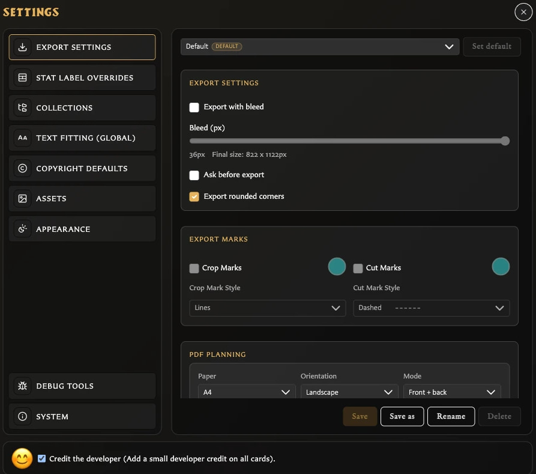
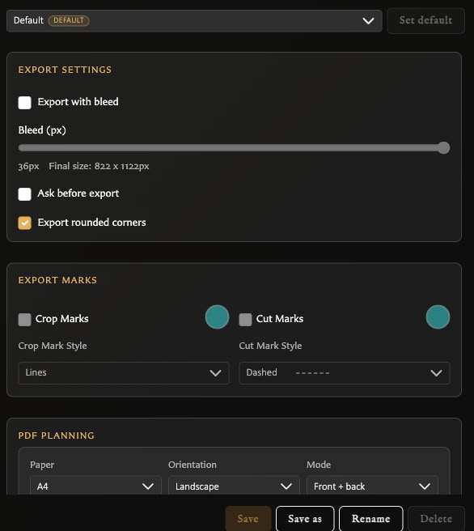

# Settings Reference

This page explains every visible Settings category in v0.8.0. For where the categories appear and how Save or Discard works, see [Understand the Settings Window](./understand-the-settings-window.md).

<!-- help-visual:p087:start -->
<figure class="hqcc-help-figure hqcc-help-figure--wide" markdown="span">
  
  <figcaption>Settings uses category navigation on the left and the selected category’s controls on the right.</figcaption>
</figure>
<!-- help-visual:p087:end -->

## Export Settings

Export profiles store reusable image and PDF defaults.

<!-- help-visual:p091:start -->
<figure class="hqcc-help-figure hqcc-help-figure--portrait" markdown="span">
  
  <figcaption>Export profiles keep named combinations of image, mark, and PDF defaults ready for different jobs.</figcaption>
</figure>
<!-- help-visual:p091:end -->

### Image export options

- **Export with bleed** adds the chosen bleed amount around each card and shows the resulting pixel dimensions.
- **Ask before export** controls whether the app asks about export options before producing files.
- **Export rounded corners** includes rounded corners when bleed is off.
- **Crop Marks** and **Cut Marks** can add configurable marks, colours, and line styles when bleed is enabled.

Enabling bleed disables rounded corners and makes the Crop Marks and Cut Marks toggles available. Each mark's colour and style remain unavailable until that mark is enabled.

### PDF planning options

- **Paper** chooses the target paper size.
- **Orientation** chooses portrait or landscape.
- **Mode** chooses front-only or front-and-back output.
- **Duplex preset** controls how reverse sheets are transformed for double-sided printing.
- **PDF bleed source** tells the app whether the card image already includes bleed or whether PDF layout should add it.
- **Bleed per edge (mm)** sets the print bleed measurement.

See [Configure Export Defaults and Profiles](./configure-export-defaults-and-profiles.md) for the purpose of every option, practical starting configurations, and profile management. Also see [Export Cards as PNG Images](../exporting-and-printing/export-cards-as-png-images.md) and [Export a Deck as PDF](../exporting-and-printing/export-a-deck-as-pdf.md).

## Stat Label Overrides

Stat Label Overrides changes the printed wording used for card statistics. The fields are grouped by where they apply:

- Shared: Attack Dice and Defend Dice.
- Monster Card: Movement Squares, Body Points, and Mind Points.
- Hero Card: Starting Points, Body, and Mind.

Enter replacement wording, enable **Enable stat label overrides**, and choose **Save**. Clear an individual field to return that label to its normal localized wording. These are global label preferences rather than values stored separately on one card.

## Collections

**Group collections by folders** interprets slashes in collection names as folder paths. For example, `spells/fire` and `spells/air` appear beneath a `spells` group.

This changes how collections are presented. It does not move, duplicate, or delete their cards. See [Create and Organize Collections](../managing-your-library/collections/create-and-organize-collections.md).

## Text Fitting (Global)

The global text-fitting controls are separate for **Title** and **Stat headings**:

- **Prefer ellipsis over shrink** chooses truncation rather than shrinking below the preferred point.
- **Min font size** sets how far text may shrink.
- **Reset Title Defaults** and **Reset Stat Defaults** restore their respective defaults.

These settings do not control the per-card body-text **Scale to fit** option. See [Format Card Text](../making-cards/format-card-text.md).

## Copyright Defaults

- **Default copyright** supplies the text used by newly created cards unless the card overrides it.
- **Copyright Visibility** sets the initial visibility separately for each template.

The template toggles affect new-card defaults. Existing cards retain their saved text and visibility until edited.

## Assets

**Enable auto-classification** lets the app categorize uploaded images as Artwork or Icon. Turning it off stops automatic classification; you can still override an individual asset's kind in Assets.

Automatic classification is unavailable in Safari and the setting is disabled there. See [Understand the Assets Workspace](../managing-your-library/assets/understand-the-assets-workspace.md).

## Appearance

### Theme

- **Use system preference** follows the operating-system or browser theme.
- **Dark** and **Light** select an explicit app theme when system preference is off.

### Typography

Titles and stats each provide:

- **Use aligned numeral style** to make numerals align consistently.
- **Use fixed-width numerals** to give each numeral the same width.

Body text keeps the numeral behavior used by the original printed-card style.

## Credit the developer

**Credit the developer** appears at the bottom of every Settings category. When enabled, cards include the app's small developer credit. This is independent from your own copyright text.

## System

System is an information and storage panel rather than a customization panel. It shows:

<!-- help-visual:p093:start -->
<figure class="hqcc-help-figure hqcc-help-figure--wide" markdown="span">
  
  <figcaption>System reports the browser storage used by the app and provides a way to refresh the estimate.</figcaption>
</figure>
<!-- help-visual:p093:end -->

- App name and version.
- Developer and community links.
- Estimated total browser/app storage use.
- Asset, card, and other-library storage proportions and record counts.
- A detailed breakdown of other stored app data when available.
- **Refresh browser storage estimate** to recalculate the figures.

Storage figures are estimates for the current browser profile. They are not a backup and do not indicate how much space remains inside a `.hqcc` file.

## Debug Tools

Debug Tools appears only when diagnostic tools are enabled. In v0.8.0 it can show:

- **Show text bounds** for visual diagnostics.
- Thumbnail JPEG migration status.
- Remote-asset diagnostic controls in remote mode.
- **Clear asset classification**, which permanently removes automatic and manual asset-kind classifications.

Do not use **Clear asset classification** as a normal organization tool. The app warns that it is destructive.

The visible message saying Debug will be removed after version 0.5.x is stale in v0.8.0. Treat the entire category as diagnostic and subject to change.

## Backup relationship

Library backup includes settings tied to the portable library, including export profiles, stat labels, copyright defaults, and saved border colours. It does not include every personal preference: language, theme, collection display, automatic asset classification, general text fitting, numeral styling, and developer credit remain specific to the current app location. The **System** storage display itself is only an estimate and does not replace [Back Up and Restore Your Library](./back-up-and-restore-your-library.md).
