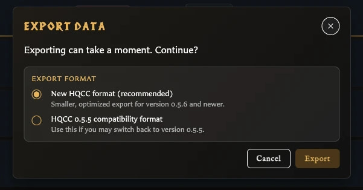
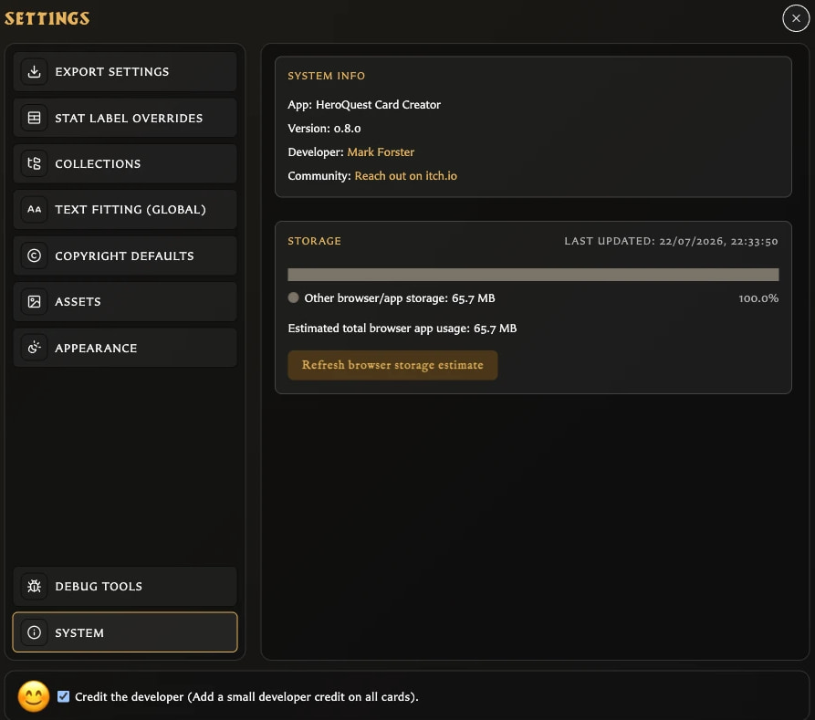

# Understand Backups and Local Data

HeroQuest Card Creator keeps your working library with the app in the browser profile or installed copy you are currently using. It does not automatically place your cards in an online account. **Export library** creates the portable safety copy that you control.

## Where are the backup controls?

The left navigation contains two related actions:

- **Export library** creates a downloadable `.hqcc` backup.
- **Import library** reads a backup and replaces the library in the current app location.

These actions concern your editable library. They are different from exporting card images or a printable PDF.

## What does the Export data window show?

After choosing **Export library**, the **Export data** window explains that exporting may take a moment and offers two formats:

<!-- help-visual:p097:start -->
<figure class="hqcc-help-figure hqcc-help-figure--compact" markdown="span">
  
  <figcaption>Export data creates a restorable library backup in the selected HQCC format.</figcaption>
</figure>
<!-- help-visual:p097:end -->

- **New HQCC format (recommended)** is the normal choice for version 0.5.6 and newer.
- **HQCC 0.5.5 compatibility format** is for a backup that may need to be imported into version 0.5.5.

Choose **Export** to begin or **Cancel** to leave without creating a file. While the backup is being prepared, the app may show **Preparing**, **Exporting data**, and **Finalizing** progress.

## What does a library backup contain?

A current backup preserves the editable parts of your library, including:

- Saved and recently deleted cards, plus the current card-editing state.
- Uploaded assets and saved custom back logos.
- Collections and their card membership.
- Card pairings.
- Decks, groups, sets, entries, and quantities.
- Export profiles and their image and PDF settings.
- Custom stat labels, copyright defaults, and saved border colours.

The backup is intended to restore these items together as one library.

## Which preferences are not part of the portable library?

Do not assume every personal or browser-specific preference will follow the backup. In particular, choices such as the current language, light or dark theme, collection display preferences, automatic asset classification preference, general text-fitting preferences, numeral styling, and developer-credit preference remain choices for the app location where they were set.

After importing on another browser profile or app copy, review [Settings Reference](./settings-reference.md) and reapply any personal preferences you want there.

## Why can the app look empty in another browser?

Each browser profile and installed app copy has its own local working area. A different browser, a private window, another browser profile, cleared site data, or a separately installed copy can therefore open with an empty library even though your work still exists elsewhere.

Use **Export library** in the location containing your work, then **Import library** in the destination. Keep the `.hqcc` file somewhere outside the app so it remains available if that local working area is cleared.

## What does System storage show?

Open **Settings**, then **System**, to see an estimate of the current app location's storage use and a breakdown for assets, cards, and other library information. **Refresh browser storage estimate** recalculates the figures.

<!-- help-visual:p094:start -->
<figure class="hqcc-help-figure hqcc-help-figure--wide" markdown="span">
  
  <figcaption>System reports the browser storage used by the app and provides a way to refresh the estimate.</figcaption>
</figure>
<!-- help-visual:p094:end -->

This display is informational. It is not a backup, does not create a recovery file, and is not the size of a future `.hqcc` file.

## Related guides

- [What Is a Library Backup?](../concepts/what-is-a-library-backup.md)
- [Back Up and Restore Your Library](./back-up-and-restore-your-library.md)
- [Fix Backup and Restore Problems](../troubleshooting/fix-backup-and-restore-problems.md)
- [Use a Downloaded Copy](../getting-started/use-a-downloaded-copy.md)
