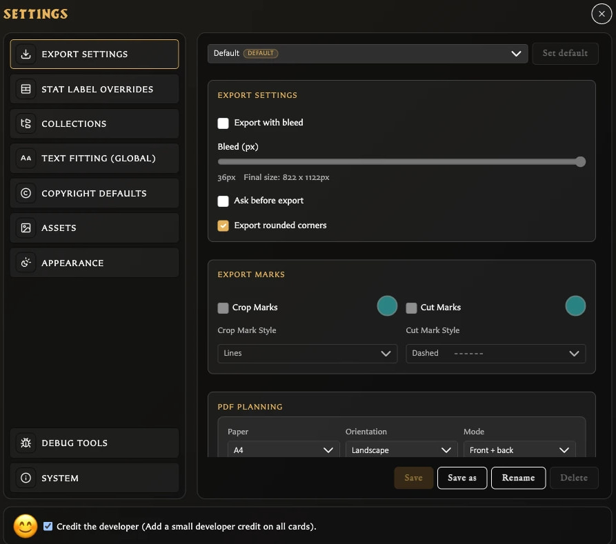

# Understand the Settings Window

**Settings** controls app-wide preferences. Use it when you want a choice to affect more than the card currently open, such as export defaults, card-label wording, collection organization, text fitting, copyright defaults, asset classification, or appearance.

Open **Settings** from the left navigation. You can also press **Q** when keyboard shortcuts are available.

## What you see

The Settings window has three main areas:

<!-- help-visual:p086:start -->
<figure class="hqcc-help-figure hqcc-help-figure--wide" markdown="span">
  
  <figcaption>Settings uses category navigation on the left and the selected category’s controls on the right.</figcaption>
</figure>
<!-- help-visual:p086:end -->

- The category list on the left chooses which group of settings is shown.
- The active panel on the right contains the controls for that category.
- **Credit the developer** remains available along the bottom of every category.

The normal categories are:

- **Export Settings**
- **Stat Label Overrides**
- **Collections**
- **Text Fitting (Global)**
- **Copyright Defaults**
- **Assets**
- **Appearance**
- **System**

**Debug Tools** can also appear in builds where diagnostics are enabled. It contains maintenance and destructive actions rather than normal card-creation preferences.

## How changes are saved

Settings do not all use one save method.

### Changes that apply immediately

Most checkboxes, theme choices, text-fitting controls, copyright defaults, asset-classification preferences, and the developer-credit choice apply when you change them. Close Settings when you are finished.

### Panels with an explicit Save action

**Export Settings** and **Stat Label Overrides** can hold unsaved edits. If you try to close Settings or change category, the app opens **Discard changes?** and offers:

<!-- help-visual:p089:start -->
<figure class="hqcc-help-figure hqcc-help-figure--wide" markdown="span">
  
  <figcaption>An Unsaved indicator and enabled Save action show when a settings panel needs explicit confirmation.</figcaption>
</figure>
<!-- help-visual:p089:end -->

- **Cancel** to remain on the current panel.
- **Save** to keep the edits and continue.
- **Discard** to continue without keeping them.

An **Unsaved** indicator and enabled **Save** button identify a changed export profile. Stat labels have their own Save button.

## What Settings does not do

Settings changes are preferences, not edits to the currently selected card unless the setting explicitly affects rendering or global labels. Defaults for new cards, such as copyright visibility, do not automatically rewrite every saved card.

The **Language** and quick **Theme** menus are in the left navigation rather than inside the Settings category list. Appearance also provides the full theme and numeral-style controls.

## Related help

- [Settings Reference](./settings-reference.md)
- [Change Language and Appearance](./change-language-and-appearance.md)
- [Configure Export Defaults and Profiles](./configure-export-defaults-and-profiles.md)
- [Fix Settings Problems](../troubleshooting/fix-settings-problems.md)
- [Back Up and Restore Your Library](./back-up-and-restore-your-library.md)
