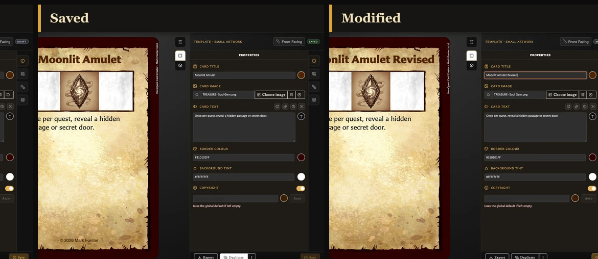

# Fix Card Saving and Duplication Problems

## Save is disabled

Check the card title, name, or back label required by the selected template. It must contain more than spaces.

<!-- help-visual:p030:start -->
<figure class="hqcc-help-figure hqcc-help-figure--panoramic" markdown="span">
  
  <figcaption>Save becomes available when a valid saved card has changes waiting to be stored.</figcaption>
</figure>
<!-- help-visual:p030:end -->

If the card status is **saved**, Save remains disabled until you make a change. That means the editor already matches the library copy.

## I left the card and my changes disappeared

Choosing **Discard** in **Discard changes?** deliberately continues without saving the current edits. Return to the card to see its last saved version.

<!-- help-visual:p032:start -->
<figure class="hqcc-help-figure hqcc-help-figure--compact" markdown="span">
  
  <figcaption>When you leave with unsaved edits, choose whether to stay, save the card, or discard the changes.</figcaption>
</figure>
<!-- help-visual:p032:end -->

Use **Cancel** when you want to stay and review the work, or **Save** when you want to keep it before continuing. Draft recovery cannot restore edits that were deliberately discarded or replaced by another draft.

## Save did not continue to the next screen

When **Save** is chosen from the unsaved-changes window, navigation continues only after a successful save. Check that the required identifying field is complete, then save again. If the card remains **Modified**, keep the editor open and do not choose Discard unless losing those edits is acceptable.

## Duplicate is missing

The current card must be saved before it can be duplicated. Save the draft first, then look for **Duplicate** in the bottom toolbar.

## The duplicate is not in the source deck

This is expected. Duplication creates a new card, but deck membership is not copied. Add the saved duplicate to the required deck separately.

## Duplicate with pairing produced an unpaired card

This is a confirmed v0.8.0 issue. Save the duplicate, open its **Pairing** tab, and pair it manually. The duplicate can still inherit collection membership from its source when first saved.

## I deleted the wrong card

If you chose **Move to recently deleted**, open **Recently deleted**, select the card, and choose **Restore**. If you chose **Delete permanently**, the card and affected collection, pairing, and deck references cannot be restored through the app. See [Organize and Recover Cards](../managing-your-library/organize-and-recover-cards.md).

## Related guides

- [Troubleshooting Index](./index.md)
- [Understand Card States and Saving](../making-cards/understand-card-states-and-saving.md)
- [Save or Discard Card Changes](../making-cards/save-or-discard-card-changes.md)
- [Duplicate a Card](../making-cards/duplicate-a-card.md)
