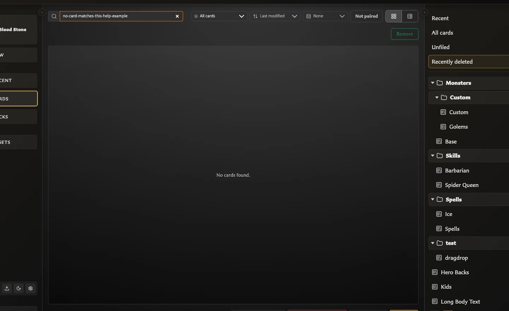

# Fix Cards Workspace Problems

The Cards workspace combines a library scope, search, filters, and selection. If a card or action seems to be missing, first work out which of those layers is narrowing the screen. Searching, filtering, sorting, grouping, selecting, and switching views do not edit or delete a card.

## Cards says No cards found

Clear the view in this order:

<!-- help-visual:p111:start -->
<figure class="hqcc-help-figure hqcc-help-figure--wide" markdown="span">
  
  <figcaption>No cards found usually means the active search and filters do not match any saved cards.</figcaption>
</figure>
<!-- help-visual:p111:end -->

1. Choose **All cards** in the Collections panel.
2. Clear **Search saved cards by name**.
3. Set the face or template filter to **All cards**.
4. Turn off **Not paired**.
5. If a missing-artwork filter is visible, turn it off unless you are deliberately looking for affected cards.

Sorting, grouping, and switching between Grid and Table change the arrangement, not which cards qualify. If the screen is still empty, check **Recently deleted** and confirm that you opened the same browser, profile, and app address where the cards were created.

## Collection counts changed while I searched

The counts in the Collections panel can respond to the active search and **Not paired** filter. This lets you see how many matching cards remain in each collection without opening every collection.

Clear the search and turn off **Not paired** to return to the broad counts. Sorting, grouping, and Grid or Table view do not change them.

## A card is missing from a named collection

Choose **All cards** and search for the card by its saved name. If it appears there, the card still exists but is no longer a member of that collection.

- If it appears under **Unfiled**, it does not currently belong to any named collection.
- Select the card and use **Add to collection** to put it back.
- Removing a card from a collection does not delete the card.

See [Add and Remove Cards from Collections](../managing-your-library/collections/add-and-remove-cards-from-collections.md) for the normal organization workflow.

## Select all is unavailable

**Select all** applies only to cards currently visible in the results. It is unavailable when search, filters, or the chosen collection produce no cards.

Clear the narrowing controls until the expected cards return, then choose **Select all**. The action selects the current filtered results, not every saved card in the library.

## Load is unavailable

**Load** requires exactly one selected card. It is unavailable with no selection or with several selected cards because the Card Editor can open only one card at a time.

Choose **Select none**, select the required card once, then choose **Load**. You can also double-click a normally saved card to open it directly.

## Add to collection is unavailable

Check all three requirements:

- One or more cards must be selected.
- You must be viewing normally saved cards, not Recently deleted.
- Another named collection must exist as a destination.

Create a collection first if the Collections panel contains only its built-in choices. When you are already inside a named collection, the action adds the selection to another collection rather than duplicating the cards.

## My selection behaved differently in Grid and Table

Grid and Table are two views of the same results and selection. Switching between them keeps the selected cards.

- In Grid, click a card once to select it.
- In Table, use the row or its selection checkbox.
- Use **Ctrl-click** on Windows or **Cmd-click** on macOS to add or remove individual cards from a selection.
- Use **Select none** when you want to start again.

If several cards remain selected after switching views, **Load** stays unavailable until only one is selected.

## Recently deleted is missing

The **Recently deleted** choice appears only while recoverable deleted cards exist. It disappears when that area is empty.

Cards moved there no longer appear under All cards, Unfiled, or named collections. Permanently deleted cards do not appear there and cannot be restored.

## Restore is unavailable

Open **Recently deleted** and select one or more cards. **Restore** is unavailable until the deleted-card selection contains at least one card.

After restoration, the card returns to the normal library and its prior named collection membership. The workspace leaves Recently deleted because it is removed automatically when no deleted cards remain.

## A card disappeared after I used Delete

The normal Delete window offers two different outcomes in v0.8.0:

- **Move to recently deleted** hides the card from normal results but keeps it recoverable.
- **Delete permanently** removes it without a restore path and can also remove collection, pairing, and deck references.

Choose the recoverable option unless permanent removal is deliberate. The normal **Delete** window offers both choices, so rely on the wording in the confirmation you are about to choose.

If a card has disappeared, clear the search and filters, then check **Recently deleted**. If it is not present, confirm the exact browser, profile, and app address before concluding that it was permanently deleted. See [Understand Backups and Local Data](../settings-and-data/understand-backups-and-local-data.md) if the whole library looks different or empty.

## I cannot see the Collections panel

On narrower screens, use the collections-panel control to open Collections as a drawer. On wider screens, the same control collapses or expands the side panel.

If the panel still has too little room, widen the app window. The panel contains Recent, All cards, Unfiled, Recently deleted when available, named collections, and collection-management actions.

## Before assuming a card was deleted

Check these locations and controls without changing data:

1. Choose **All cards**.
2. Clear search, face or template filtering, and **Not paired**.
3. Check the expected named collection and **Unfiled**.
4. Check **Recently deleted**.
5. Confirm the same browser, profile, app address, or downloaded-app launch method.

For a full tour of the controls, see [Understand the Cards Workspace](../managing-your-library/understand-the-cards-workspace.md). For deliberate deletion and restoration, see [Organize and Recover Cards](../managing-your-library/organize-and-recover-cards.md). Return to the [Troubleshooting Index](./index.md) for another symptom.
