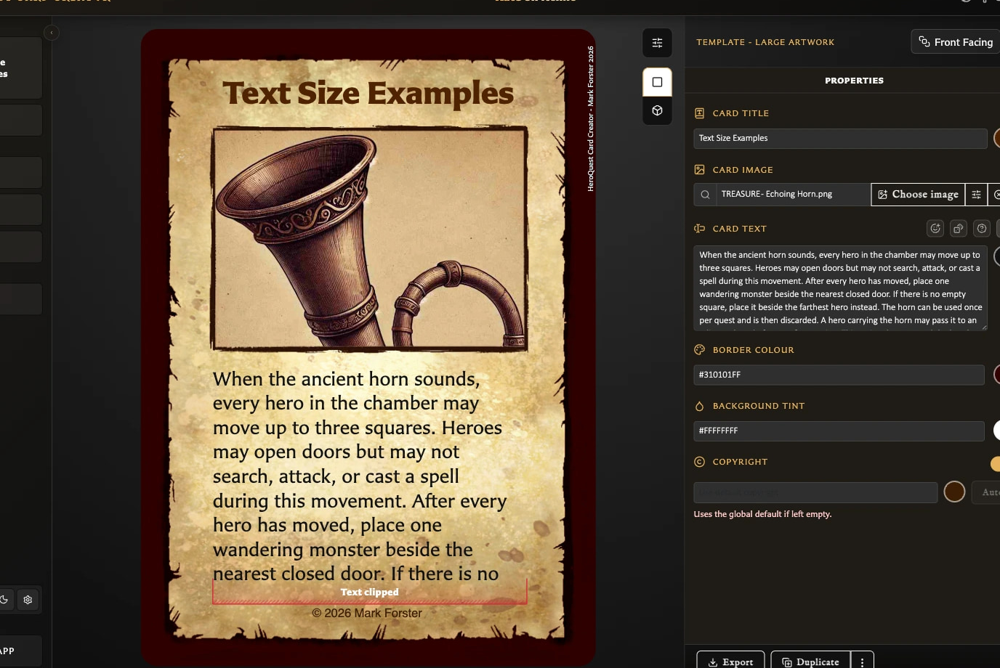

# Fix Clipped or Overflowing Card Text

## The card says Text clipped

**Text clipped** means some wording does not fit inside the card's fixed body-text area. The affected lines are outside the visible area, so fix the problem before exporting or printing.

<!-- help-visual:p112:start -->
<figure class="hqcc-help-figure hqcc-help-figure--wide" markdown="span">
  
  <figcaption>Text clipped marks content that extends beyond the available card area.</figcaption>
</figure>
<!-- help-visual:p112:end -->

Try these steps in order:

1. Turn on **Scale to fit** beside the body-text field.
2. Remove unnecessary blank lines or paragraph breaks.
3. Shorten or rewrite the wording.
4. Reduce any large text formatting, headings, or unusually spacious layout.
5. If the card is not tied to this layout, consider creating it with a template that gives the content more suitable space.

Save only after the complete wording is visible and readable.

## The warning remains after Scale to fit

The app will not shrink body text below its minimum size. If the warning remains, the content still needs more room. Shorten the text or reduce the formatting and spacing that enlarge it.

## Will Text clipped appear in my export?

The red **Text clipped** warning is an editing aid. It is not included in exported card images and is suppressed in Deck Preview.

This does not mean the overflow has been fixed. Any wording that is clipped in the card preview will still be missing from the exported or printed card. Resolve the warning before export.

## Scale to fit is missing

Check the template. The switch is available on **Small Artwork**, **Large Artwork**, **Rules**, **Hero Back**, and **Labelled Back** because those layouts have fixed body-text areas.

Hero and Monster cards use a flexible text area instead. Logo Back has no body-text field. On Labelled Back, enable back text before looking for its fitting control.

## Text fits, but it is too small

Scale to fit prioritizes keeping all wording visible. For a more readable result, remove blank lines, shorten the copy, reduce larger formatting, or use a more suitable template. Turning fitting off restores the ordinary text size, but the preview may then clip the overflow.

## The field will not accept more text

Body text has a 2,000-character limit. Shorten the content before continuing. Reaching this limit is different from visual clipping: shorter text can still overflow because of its formatting or the available area.

For normal fitting behavior, see [Fit Body Text on a Card](../making-cards/fit-body-text-on-a-card.md). For supported formatting, see [Format Card Text](../making-cards/format-card-text.md).

Return to the [Troubleshooting Index](./index.md) to find help for another symptom.
