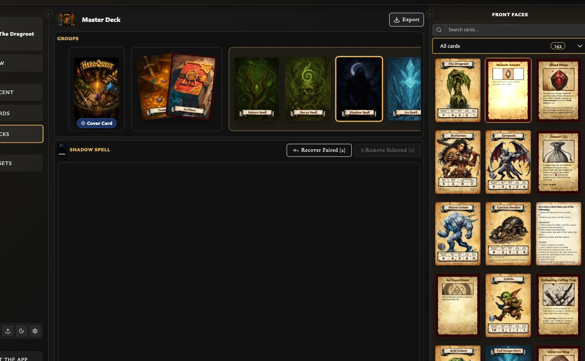
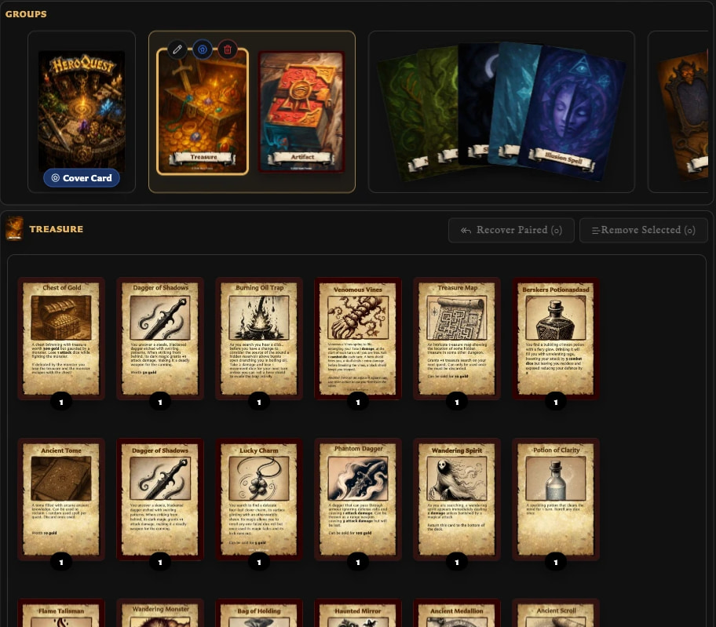

# Fix Deck Editing Problems

## A back or front will not drop

Check the type of card and the target:

- Back-facing cards go to a visible slot or insertion position in **Groups**.
- Front-facing cards go to **Entries**, and a set must be selected first.
- Search and **Collections** filters can hide cards from the source list.
- A back already used by a set in the deck cannot create a second set.

Dropping on blank space or outside a valid position makes no change. Try again on the visible card-shaped slot or insertion marker.

## Entries disappeared when I selected another card

Entries always belongs to the currently selected set. Select the required back card in Groups and check the back thumbnail beside the Entries title.

## I removed a front but want it back

If you chose **Remove from set**, select the set and use **Recover Paired**. The front should be listed under **Paired (Not In Set)**.

<!-- help-visual:p076:start -->
<figure class="hqcc-help-figure hqcc-help-figure--wide" markdown="span">
  
  <figcaption>Recover Paired restores eligible paired fronts to a set after they have been removed.</figcaption>
</figure>
<!-- help-visual:p076:end -->

If you chose **Remove and unpair**, recreate the pairing from the card's Pairing tab or drag the front from **Front faces** into the set again.

## A group vanished after I moved or deleted a set

Empty groups are cleaned up automatically when other groups remain. Moving the only set out of a group or deleting its final set can therefore remove that group. The final empty group in an otherwise empty deck remains as a starting slot.

<!-- help-visual:p073:start -->
<figure class="hqcc-help-figure hqcc-help-figure--wide" markdown="span">
  
  <figcaption>A group is represented by the sets it contains; moving or deleting its last set leaves no group section to display.</figcaption>
</figure>
<!-- help-visual:p073:end -->

## I cannot name or reorder groups

This is expected. Groups are unnamed visual sections and are not reordered. Move and reorder the sets inside them instead. Sets are identified by their back-facing cards rather than separate names.

## I cannot duplicate a deck or change a set's back

These actions are not available in the version 0.8.0 deck interface. Create a new deck manually to reproduce a deck, or delete and recreate a set when it needs a different back.

## Deletion removed more than expected

The confirmation describes the scope:

- Deleting a deck removes its deck organization, not its saved cards or pairings.
- Deleting a set removes that set and its entries, not its saved cards or pairings.
- **Remove from set** keeps the pairing and allows recovery.
- **Remove and unpair** removes the matching pairing as well as the entry.

If a pairing was removed, recreate it through the Card Editor's **Pairing** tab.

## Related guides

- [Troubleshooting Index](./index.md)
- [Understand the Decks Workspace](../building-decks/understand-the-decks-workspace.md)
- [Organize Deck Groups and Sets](../building-decks/organize-deck-groups-and-sets.md)
- [Manage and Recover Deck Entries](../building-decks/manage-and-recover-deck-entries.md)
- [Fix Pairing Problems](./fix-pairing-problems.md)
