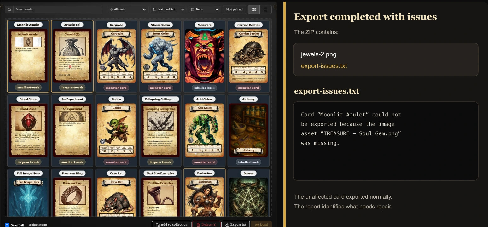
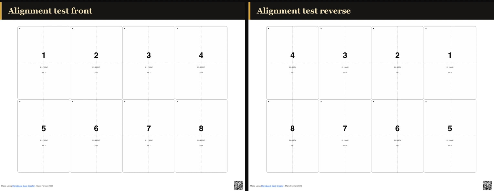

# Fix Export and Print Problems

Start with the result you expected: individual card images, one copy of each deck face, or quantity-aware print sheets. Choosing the wrong export type or scope can look like a failed export even when it completed correctly.

## Export is disabled

In **Cards**, select one or more cards before using the selection export. Inside a collection, clear the selection when you want **Export all from this collection** instead.

In **Decks**, the deck needs exportable set structure before **Export** becomes available. Add a back-facing card to create a set and add front entries when the chosen PDF scope requires complete sets.

Inside PDF export, **Export PDF** and **Export alignment test PDF** are unavailable when the chosen scope produces no print positions. Check the summary for excluded empty or unselected sets.

## The export contains fewer cards or faces than expected

Check these common causes:

- A Cards export uses the current selection, collection, or filtered scope shown when the action is chosen.
- Declining the paired-faces question exports only the original scope.
- Deck **Image Export** includes each distinct face once, even when its quantity is higher or it appears in several sets.
- PDF **Complete sets** excludes empty sets. **All sets** and **Selected sets** can include an empty set with a placeholder front.
- Missing required artwork can cause an affected face to be skipped.

Use [Export Cards as PNG Images](../exporting-and-printing/export-cards-as-png-images.md) for exact image scopes. Use [Export a Deck as PDF](../exporting-and-printing/export-a-deck-as-pdf.md) when repeated card quantities need to become repeated print positions.

## The ZIP contains export-issues.txt

Open **export-issues.txt** and repair the named cards before producing the final export. The report records known skips such as cards whose required artwork could not be found.

<!-- help-visual:p113:start -->
<figure class="hqcc-help-figure hqcc-help-figure--wide" markdown="span">
  
  <figcaption>When a face cannot be exported, the ZIP includes a report identifying the skipped card and missing image.</figcaption>
</figure>
<!-- help-visual:p113:end -->

The report does not guarantee that every unexpected card-generation failure receives its own line. Compare the files in the ZIP with the scope shown before export. If a face is absent but not named, try exporting that saved card by itself and check its preview, artwork, and text before retrying the bulk export.

## The app says No images were exported

No card image was successfully produced for that run. Check that the scope still contains cards, then try one saved card by itself.

If the individual export also fails, reopen the card and check that its artwork is available and its preview appears complete. Repair missing artwork before retrying. If one card works, retry the bulk export with a smaller selection to identify the affected card.

## The app says Could not export images

The export did not complete. Keep the source cards unchanged and try again once. For a bulk run, retry a smaller selection; for a PDF, return to the summary and retry with the saved profile or default layout before adding custom choices again.

If only one card repeatedly fails, open and export that card separately. An unexpected failure may not be named in **export-issues.txt**.

## Export appears to be stuck

Large exports move through visible stages:

- **Exporting images** prepares each included face and shows completed faces against the total.
- **Finalizing** assembles the ZIP or PDF after the card images are ready. It may show a percentage or remain active without one.
- **Cancelling** means the app has received the request and is stopping the run.

Allow **Finalizing** time to complete, especially for a large deck. Do not start another export while the current progress window is active.

## What happens if I cancel?

Choose **Cancel** in the progress window. The button changes to **Cancelling** and becomes unavailable while the current work stops. A cancelled run does not produce the completed ZIP or PDF; the cards, deck, and export profile are not changed.

If you still need the files, begin a new export after the progress window closes.

## The export finished but no download appeared

Check the browser's downloads list and whether it blocked downloads from the app. The file may have downloaded without opening a separate window.

Retry once with a single card or the alignment test PDF. If small downloads work but a large export does not, retry the larger run in smaller parts. Keep the cards and local library intact while investigating; clearing browser data is not an export recovery step.

## PDF says Layout has no printable slots

The selected paper and layout leave no room for even one card. Reduce the page margins or the horizontal and vertical card spacing, or choose an orientation with more usable room.

Return to the saved profile or default layout if you are unsure which custom value caused the problem. Do not reduce the card dimensions merely to silence the message unless you deliberately want physically smaller cards.

## PDF says it cannot build sheets

Return to the PDF summary and confirm that the chosen scope has print positions. For **Selected sets**, select at least one set. For **Complete sets**, add a front entry or choose a scope that includes empty sets with placeholder fronts.

Then restore the default layout and try again. If the summary shows print positions but the message continues, leave the deck unchanged and retry after reopening it.

## Printed cards are the wrong size

Check the print window rather than changing the deck:

1. Load the same paper size selected in PDF export: A4 or Letter.
2. Print using **Actual size** or **100%**.
3. Turn off **Fit to page**, **Shrink oversized pages**, or other automatic scaling.
4. Measure the alignment test before printing the full deck.

Changing printer scaling can alter both card size and front-to-back alignment.

## Backs are in the wrong positions

Use **Export alignment test PDF** with the same paper, orientation, duplex setting, feed path, and print scaling intended for the deck.

If backs appear on the wrong left-to-right positions, try a preset with horizontal mirroring. If positions are correct but every back is upside down, try a preset with 180-degree rotation. The four available combinations are **Normal**, **Mirror horizontally**, **Rotate 180°**, and **Mirror + rotate 180°**.

There is no universal preset because printers turn paper differently.

## Fronts and backs drift out of alignment

First confirm **Actual size** or **100%** and matching paper sizes. Then print another alignment test.

If every back is offset by a similar amount, check the printer's paper guides, margins, and duplex setup. If the offset varies across the sheet or between runs, the physical paper feed may be moving. The app can arrange matching positions, but it cannot correct inconsistent printer registration.

Use bleed when small cutting or registration differences would otherwise expose white edges. Bleed does not correct a wrong duplex preset or large printer offset.

## Marks, bleed, or rounded corners are unavailable

Open **Settings > Export Settings** or the per-export options and check the dependencies:

- Bleed amount, crop marks, and cut marks require **Export with bleed**.
- Mark colour and style require that mark to be enabled.
- Rounded corners are unavailable while bleed is enabled.

See [Configure Export Defaults and Profiles](../settings-and-data/configure-export-defaults-and-profiles.md) before changing a saved profile.

## Safest first print

<!-- help-visual:p114:start -->
<figure class="hqcc-help-figure hqcc-help-figure--panoramic" markdown="span">
  
  <figcaption>The alignment test places numbered cells in mirrored positions on the front and reverse pages.</figcaption>
</figure>
<!-- help-visual:p114:end -->

1. Confirm the PDF summary, scope, paper, orientation, and face mode.
2. Export the alignment test PDF.
3. Print it at **Actual size** or **100%** using the intended duplex settings.
4. Check card size, front/back position, orientation, and cutting guides.
5. Change one layout, duplex, or printer choice at a time and repeat the test.
6. Print the full deck only after the test is correct.

Return to the [Troubleshooting Index](./index.md) to find help for another symptom.
