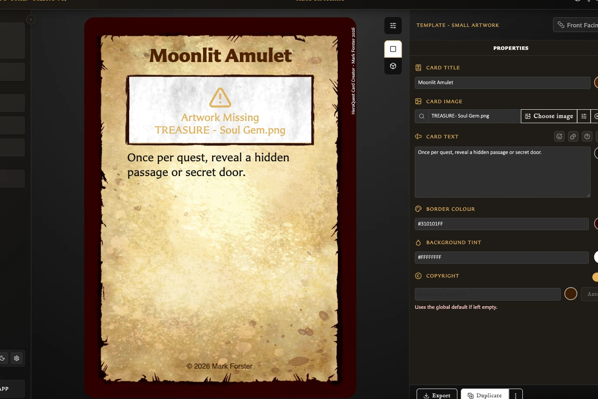

# Fix Missing Artwork

Missing artwork means a saved card still has an image selected that is no longer available in the current library. This can happen after damaged or incomplete library data, or when a removed image remains selected unexpectedly.

Normal deletion is intended to clear affected card fields. It should not be used as a way to deliberately create missing artwork.

## Find affected cards

When the app detects missing artwork, it can expose the problem in three places:

<!-- help-visual:p115:start -->
<figure class="hqcc-help-figure hqcc-help-figure--wide" markdown="span">
  
  <figcaption>Artwork Missing identifies the affected image area and names the file that needs replacing.</figcaption>
</figure>
<!-- help-visual:p115:end -->

- A **Missing artwork detected** banner links to the Cards workspace.
- The Cards workspace offers a **Missing Artwork** filter so you can identify affected cards.
- An export warning names cards whose image, icon, or custom back logo cannot be found and can offer to open those cards or continue without the missing images.

Use the banner or the Cards filter to locate a card, then open it in the Card Editor.

## Repair a card

1. Open the affected card in the Card Editor.
2. In **Properties**, find the missing image or icon field.
3. Choose **Choose image**.
4. Select an available replacement asset. Upload it first if necessary.
5. Choose **Select**.
6. Review the card preview and adjust the framing if the replacement has different proportions.
7. Choose **Save**.

The replacement does not need the same filename as the missing image. Saving the card records the newly selected asset.

For image movement, scale, rotation, and restore controls, see [Add and Position Artwork](../making-cards/add-and-position-artwork.md).

## If the banner or filter does not appear

In version 0.8.0, deleting an image can leave it selected on a saved card without the usage count, delete warning, missing-artwork banner, or Cards filter detecting it. The card's image field still named the deleted file.

If a card preview is missing an image but no warning appears:

1. Open the card directly from Cards.
2. Inspect its image and icon fields for the missing filename.
3. Choose a replacement asset and save the card using the steps above.

This is a known v0.8.0 detection issue, not evidence that the card is beyond repair.

## Exporting while artwork is missing

If export identifies missing assets, repair the named cards before producing the final files. Continuing can omit the unavailable images or skip affected output, depending on the export path. Keep the warning or generated issues report until every affected card has been checked.

## Related help

- [Troubleshooting Index](./index.md)
- [Understand the Assets Workspace](../managing-your-library/assets/understand-the-assets-workspace.md)
- [Upload and Organize Assets](../managing-your-library/assets/upload-and-organize-assets.md)
- [Replace, Convert, and Delete Assets](../managing-your-library/assets/replace-convert-and-delete-assets.md)
- [Back Up and Restore Your Library](../settings-and-data/back-up-and-restore-your-library.md)
