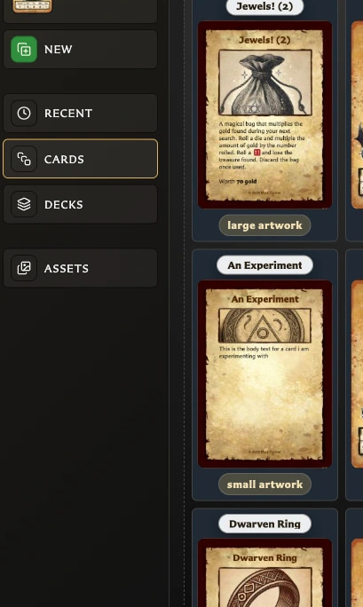

# Fix Navigation, Download, and Screen Problems

## The navigation will not expand

At widths of 1280 pixels or less, the app forces the navigation into compact mode. Widen the browser window beyond 1280 pixels, then choose **Expand navigation** again.

<!-- help-visual:p007:start -->
<figure class="hqcc-help-figure hqcc-help-figure--portrait" markdown="span">
  
  <figcaption>When navigation is expanded, the destination labels appear beside their icons.</figcaption>
</figure>
<!-- help-visual:p007:end -->

The compact icons still work. Point to or focus one to see its label, or use [Keyboard Shortcuts](../reference/keyboard-shortcuts.md).

## Check for updates is missing

The label depends on the copy you are running:

- Hosted copies normally show **Get the app** instead.
- Downloaded or directly opened local copies show **Check for updates?**.
- Only downloaded and npm builds perform automatic remote update checks.

Use the footer version to identify the current copy. Update checking also requires an internet connection.

## An update notice is not appearing

No notice is shown when the current version is already up to date, the app cannot confirm a newer version, or the current distribution does not support automatic checks. If you are offline, reconnect and reopen the app.

## My cards are missing in the downloaded copy

The new copy probably opened a different browser storage location. Try the same browser, launch method, local address, and port used previously.

Once the cards are visible, export a `.hqcc` backup. Open the destination copy and import that backup. Do not import until any destination library you need has also been protected because import replaces it.

## The downloaded app will not open

1. Confirm that the ZIP was fully extracted.
2. Try the bundled server launcher for your operating system.
3. On macOS, right-click **start-server.command** and choose **Open** the first time.
4. If the launcher is blocked, try opening **index.html** directly in a modern desktop browser.
5. Read the included **README.pdf** for the downloaded version.

## The app says Desktop optimized

This notice appears on phones, tablets, and narrow windows. The app may still open and partly work, but some layouts, drag interactions, and editing workflows can be difficult on smaller or touch-first screens.

For the intended experience, use a desktop browser and widen the window. The notice is informational and does not block access.

## Related guides

- [Troubleshooting Index](./index.md)
- [Understand App Navigation](../getting-started/understand-app-navigation.md)
- [Get and Update the App](../getting-started/get-and-update-the-app.md)
- [Use a Downloaded Copy](../getting-started/use-a-downloaded-copy.md)
- [Fix Backup and Restore Problems](./fix-backup-and-restore-problems.md)
