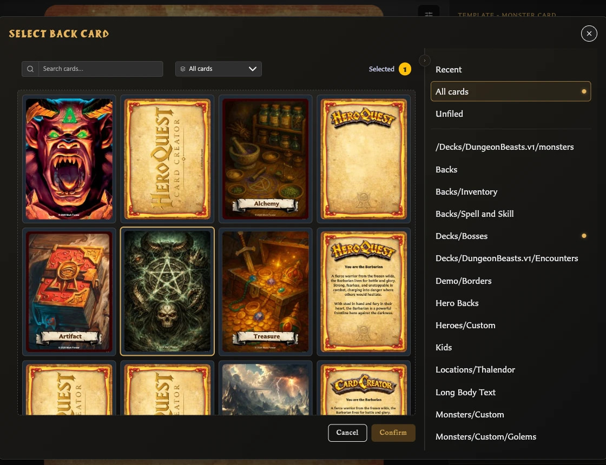

# Fix Pairing Problems

## Why can I not manage pairings?

Pairing controls require a saved card. If the Pairing tab says **Save this card to manage pairings**, complete the card's required title, name, or label and choose **Save** first.

The selector also shows only saved cards with the opposite face role. A front can select back-facing cards; a back can select front-facing cards. Check the other card's **Card face** setting if it is missing.

## Why do cards look disabled in the pairing selector?

In v0.8.0, pairing tiles incorrectly report themselves as disabled even though pointer selection works. This can make keyboard and assistive use unreliable.

<!-- help-visual:p037:start -->
<figure class="hqcc-help-figure hqcc-help-figure--wide" markdown="span">
  
  <figcaption>Unavailable choices remain visible in the pairing selector so you can understand the current filter and compatibility context.</figcaption>
</figure>
<!-- help-visual:p037:end -->

With a mouse or trackpad, choose the card tile and check that the **Selected** count changes before confirming. If you cannot operate the tile with your input method, pairing has no equivalent alternative control in this release.

## Why am I being warned before unpairing?

Unpairing changes how the two saved faces relate, so the app asks for confirmation. The warning may cover one relationship or several when you use **Unpair from all back facing cards** or change a back's selected fronts.

Choose **Cancel** if the count is unexpected. Return to the Pairing tab, inspect each paired face, and remove only the relationship you intended.

## What does Pairing in use mean?

The relationship supports one or more deck entries. Confirming will remove those dependent entries from the named deck locations as well as removing the pairing.

<!-- help-visual:p039:start -->
<figure class="hqcc-help-figure hqcc-help-figure--wide" markdown="span">
  
  <figcaption>The app identifies deck entries that will be affected before an in-use pairing is removed.</figcaption>
</figure>
<!-- help-visual:p039:end -->

Choose **Open deck** to inspect the first affected deck and set. Choose **Cancel** if you want to reorganize the deck before unpairing.

Removing a pairing never deletes the saved front or back cards.

## Why is changing Card face asking to unpair cards?

A front-to-back or back-to-front role change makes existing relationships invalid. The warning tells you that the app must remove them before applying the new role. Deck-dependent relationships receive an additional usage warning.

Cancel, review the Pairing tab and affected decks, then try the role change again when you are ready.

## Why did my duplicated card become unpaired?

Ordinary **Duplicate** deliberately creates an unpaired copy. In v0.8.0, **Duplicate with pairing** is also affected by a product defect and can save the copy unpaired.

Open the saved duplicate, choose **Pairing**, and add the required back or fronts manually. See [Duplicate a Card](../making-cards/duplicate-a-card.md).

## Why did a new template not keep my pairings?

Choosing **New** and selecting another template starts another card or draft. Pairings remain with the original saved card and are not transferred. Save the new card, then create the required pairings from its Pairing tab.

## Related guides

- [Troubleshooting Index](./index.md)
- [Understand the Pairing Tab](../making-cards/understand-the-pairing-tab.md)
- [Pair and Unpair Card Faces](../making-cards/pair-and-unpair-card-faces.md)
- [Collections, Pairing, and Decks](../building-decks/collections-pairing-and-decks.md)
