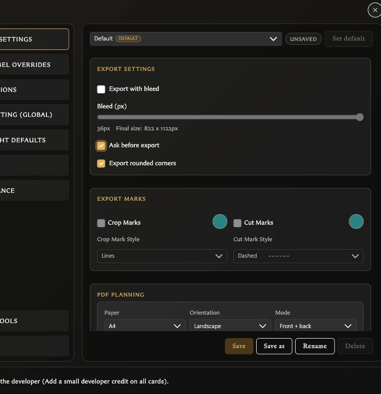

# Fix Settings Problems

Start with the symptom that matches what you see.

## My change disappeared when I changed category

Export Settings and Stat Label Overrides can contain unsaved edits. When **Discard changes?** appears:

<!-- help-visual:p090:start -->
<figure class="hqcc-help-figure hqcc-help-figure--portrait" markdown="span">
  
  <figcaption>An explicit-save panel keeps its Unsaved state until you choose Save; changing category first discards that pending edit.</figcaption>
</figure>
<!-- help-visual:p090:end -->

- Choose **Cancel** to return to the edited panel.
- Choose **Save** to keep the change and continue.
- Choose **Discard** to remove the unsaved change.

If you already chose Discard, repeat the change and choose Save before leaving the panel.

Most other Settings controls apply immediately and do not expose a separate Save button.

## Save is disabled

In Export Settings, **Save** is disabled until the selected profile differs from its saved values. A disabled button usually means there is nothing new to save.

In Stat Label Overrides, enter or clear wording, choose whether overrides are enabled, then use the panel's Save button.

## Bleed, marks, colour, or style is disabled

- Turn on **Export with bleed** before changing bleed amount, Crop Marks, or Cut Marks.
- Turn on Crop Marks or Cut Marks before changing that mark's colour or style.
- Turn bleed off if you want **Export rounded corners**.

These dependencies prevent combinations that the exporter does not use together.

## Set default or Delete is disabled

Save or discard profile edits first. The active default cannot be set as default again or deleted. Select another saved profile and make it the default before deleting the old one.

The app also keeps at least one profile, so Delete is unavailable when only one remains.

## I cannot enable automatic asset classification

Automatic asset classification is unavailable in Safari. The Assets setting is disabled there, but you can still classify individual images manually in the Assets inspector.

## The current language is missing from the language menu

This is intentional. The active language is shown by the flag on the Language button and omitted from the list. To return to English, open the same flag menu and choose **English** beside the UK flag.

## Debug Tools looks temporary or out of date

Debug Tools is a diagnostic category and may appear or disappear between builds. In v0.8.0 its notice still refers to version 0.5.x, so that notice is stale. Do not use Debug Tools as a guide to the app's current release status.

Avoid **Clear asset classification** unless you deliberately want to remove every automatic and manual asset-kind classification. The action is destructive.

## My settings need to move to another browser

Create a `.hqcc` library backup and import it in the other browser profile to move export profiles, stat labels, copyright defaults, and saved border colours with the library. Personal preferences such as language, theme, collection display, text fitting, numeral styling, and developer credit must be chosen again in the destination. Import replaces the destination library rather than merging it, so read [Back Up and Restore Your Library](../settings-and-data/back-up-and-restore-your-library.md) first.

## Related help

- [Troubleshooting Index](./index.md)
- [Understand the Settings Window](../settings-and-data/understand-the-settings-window.md)
- [Settings Reference](../settings-and-data/settings-reference.md)
- [Change Language and Appearance](../settings-and-data/change-language-and-appearance.md)
- [Configure Export Defaults and Profiles](../settings-and-data/configure-export-defaults-and-profiles.md)
