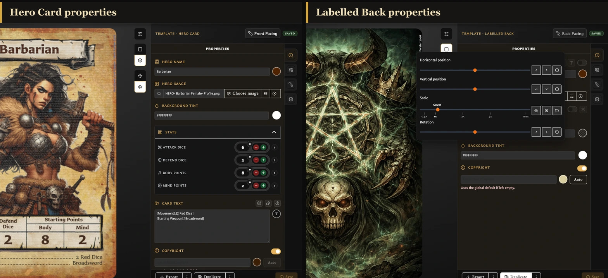
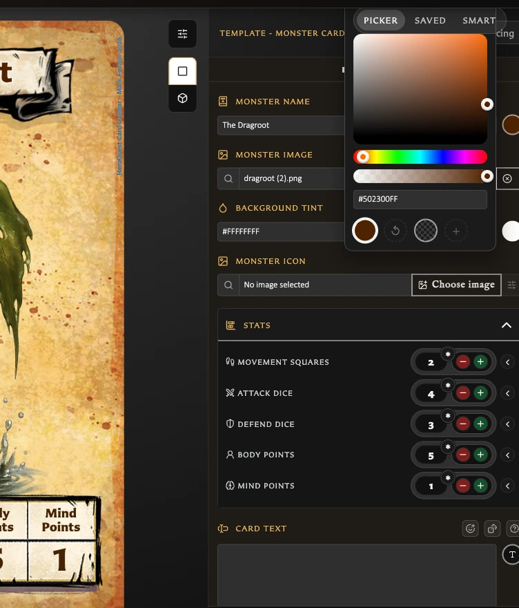

# Fix Template Control Problems

## A field or option is missing

Check the template name above the card and compare it with [Understand Template-Specific Card Controls](../making-cards/understand-template-specific-card-controls.md). Properties are tied to the layout: for example, only Monster Card has Monster icon, only Hero and Monster cards have stats, and only Labelled Back can move or restyle its label.

<!-- help-visual:p020:start -->
<figure class="hqcc-help-figure hqcc-help-figure--wide" markdown="span">
  
  <figcaption>Different templates expose different Properties because their layouts support different card parts.</figcaption>
</figure>
<!-- help-visual:p020:end -->

If you need a fundamentally different set of fields, start a new card with the appropriate template. Starting another card does not convert the saved card or transfer its pairings.

If the missing option is **Scale to fit**, see [Fix Clipped or Overflowing Card Text](./fix-clipped-or-overflowing-card-text.md) for the templates that support it and the Labelled Back prerequisite.

## I cannot add an asterisk to a wildcard stat

This is expected. The wildcard is already shown as `*`, so its separate asterisk marker is unavailable. Use a number if you need a value with an additional marker.

## The Monster icon I expected is low in the results

Classify the reusable image as **Icon** in Assets. Icon assets are ranked before Artwork and unclassified images in the quick Monster icon search, although all types can still be selected. You can also search by filename or open the full chooser.

## Default and Revert give different results

**Default** applies the template's standard value. **Revert** returns to the value present when the current edit began. If the card had already saved a custom colour, its reverted value will not match Default.

<!-- help-visual:p017:start -->
<figure class="hqcc-help-figure hqcc-help-figure--portrait" markdown="span">
  
  <figcaption>Default returns to the template’s starting value; Revert returns to the last saved value.</figcaption>
</figure>
<!-- help-visual:p017:end -->

## A deleted custom logo is still needed by cards

Use the deletion warning to switch affected cards to **Default** or another saved logo. If the logo has already been replaced, open an affected card, choose the intended saved logo, and save the change.

## I saved the wrong colour

Revert only helps during the current edit; it is not a history of saved colours. Open the colour control, choose the required colour again, and save. For an unsaved mistake affecting several fields, leave the editor and choose **Discard** only when losing all current edits is acceptable.

Return to the [Troubleshooting Index](./index.md) to find help for another symptom.
